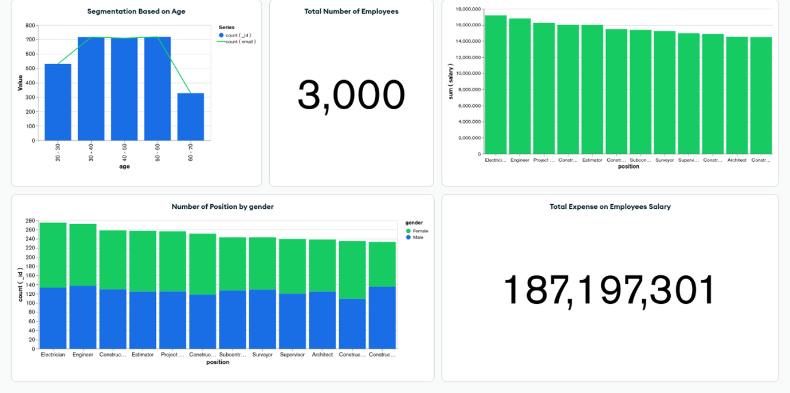
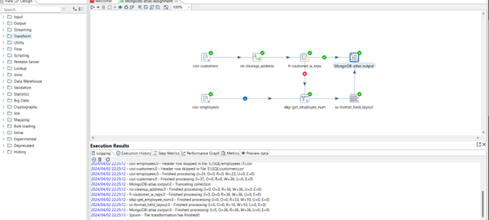

# Data Analysis Project with MongoDB

## Overview
This project involves importing a CSV file into MongoDB, performing various queries, creating visual dashboards, and implementing an ETL task using Pentaho Data Integration.

## Task 1: Data Import
### Import Data
Using the `mongoimport` command, import the `Employee_DATA.csv` file into your MongoDB cluster. Name the database `Your_first_name_Project` and the collection `MyCompanyEmployees`.

### Command Prompt Command
```bash
mongoimport --host your_host --ssl --username your_username --password your_password --authenticationDatabase admin --db Your_first_name_Project --collection MyCompanyEmployees --type csv --file Employee_DATA.csv --headerline
```

SQL Commands to switch the database and find specific result

```bash
use Your_first_name_Project
db.MyCompanyEmployees.findOne()
```


Show 10 documents from the collection with specified fields and count the total number of documents
```bash
db.MyCompanyEmployees.find({}, { first_name: 1, last_name: 1, email: 1, _id: 0 }).limit(10)
```
Count Employees in the Position of “Surveyor”
```bash
db.MyCompanyEmployees.countDocuments({ position: "Surveyor" })
```

Find Female Electricians Under 50
```bash
db.MyCompanyEmployees.find({ gender: "Female", age: { $lt: 50 }, position: "Electrician" })
```

Find Male Engineers or Architects Over 50
```bash
db.MyCompanyEmployees.find({ gender: "Male", age: { $gt: 50 }, position: { $in: ["Engineer", "Architect"] } })
```

Find Employees with Last Name Starting with "Dow" and Salary Greater than 65000
```bash
db.MyCompanyEmployees.find({ last_name: /^Dow/, salary: { $gt: 65000 } })
```

Find Employees with Salaries Between 50000 and 60000, Sorted by Age Descending
```bash
db.MyCompanyEmployees.find({ salary: { $gte: 50000, $lte: 60000 } }).sort({ age: -1 })
```

List the Top 5 Highest-Paid Female Employees
```bash
db.MyCompanyEmployees.find({ gender: "Female" }).sort({ salary: -1 }).limit(5)
```


MongoDB Atlas Charts
Create a dashboard using MongoDB Atlas Charts with the MyCompanyEmployees collection.



Use Pentaho Data Integration to replicate the ETL task demonstrated in class.




